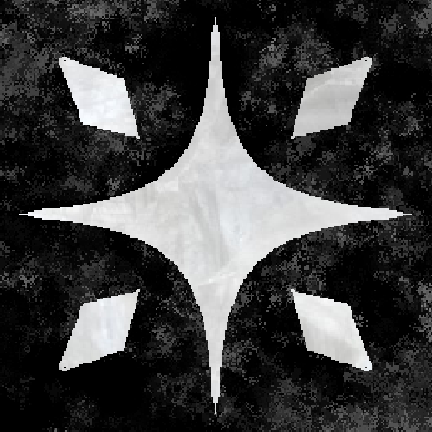

	

# 🎴 Fortunes

	<b>A mystical tarot idle-strategy game built in Godot 4</b> 
	<i>Draw cards, build decks, and unlock the secrets of the arcana in this enchanting, ever-evolving experience.</i>

---

## 🎮 Overview

Fortunes is a tarot-inspired idle-strategy game blending deep deckbuilding, resource management, and mystical progression. Build your deck from a full 78-card tarot set, unlock powerful upgrades, and discover synergies as you climb through layers of arcane challenge.

## ✨ Features

- 🃏 **Full 78-Card Tarot Deck**: All major and minor arcana, each with unique effects and upgrade paths
- 🏗️ **Dynamic Deckbuilding**: Construct, customize, and optimize your deck for fortune generation and synergy
- 💎 **Resource & Synergy Systems**: Manage clairvoyance, unlock upgrades, and discover powerful card combos
- � **Layered Progression**: Multiple prestige/reset systems, late-game scaling, and deep replayability
- 🎨 **Custom Art & Audio**: Hand-crafted tarot visuals, mystical UI, and FMOD-powered adaptive soundscapes
- 🧠 **Smart Automation**: Auto-draw, auto-upgrade, and advanced debug/dev tools for rapid iteration
- �️ **Extensible Architecture**: Modular Godot 4 codebase, clean GDScript, and robust upgrade/stat systems

## 🛠️ Tech Stack

- **Engine:** Godot 4.x
- **Language:** GDScript (modular, OOP, signal-driven)
- **Audio:** FMOD Studio integration
- **Platform:** Windows
- **Version Control:** Git
- **Artwork:** Custom, tarot-inspired, vector and raster

## 🚀 Getting Started

### Prerequisites
- Godot 4.x Engine
- FMOD for Godot (included)

### Installation
**Play Instantly:**

- Visit [itch.io/fortunes](https://itch.io/fortunes) to play the latest web version in your browser.
- Android support is coming soon!

**For local development:**
1. Clone or download this repository
2. Open the project in Godot 4.x
3. FMOD plugin is pre-configured—no extra setup needed
4. Press <kbd>F5</kbd> to run

### First Steps
1. Play the interactive tutorial to learn the basics
2. Draw cards, experiment with deckbuilding, and explore the arcana
3. Progress through upgrades, synergies, and prestige layers
4. Discover hidden combos and late-game scaling!

## 🗂️ Project Structure

- `Assets/Scripts/Core/` — Core utilities and foundation systems
- `Assets/Scripts/Managers/` — Game logic, deck, upgrade, and calculator managers
- `Assets/Scripts/Managers/Calculators/` — Card value and suit-specific logic
- `Assets/Scripts/Systems/` — Global singletons and coordinators
- `Assets/Scripts/Data/` — Game data, stats, and constants
- `Assets/Scripts/GUI/` — User interface and HUD
- `Assets/Scripts/Models/` — Data structures and type definitions
- `Assets/Scripts/Utils/` — Utility functions and helpers
- `Assets/Scripts/CardDescriptions/` — Card-specific content and lore
- `Assets/Scenes/` — Game scenes and UI layouts
- `Assets/Audio/Banks/` — FMOD banks and audio assets

## 🎨 Art & Audio

- Custom tarot-inspired card artwork (vector & raster)
- Mystical UI themes and particle effects
- FMOD-powered adaptive audio system
- Atmospheric soundscapes and feedback

## 📸 Screenshots

	
	<!-- Add more screenshots/gifs here -->

## 📄 License

This project is licensed under the MIT License. See [LICENSE](LICENSE) for details.

## 💡 Developer Notes

- Designed and implemented all core systems, including deckbuilding, upgrades, and synergy logic
- Built a modular, extensible codebase for rapid iteration and future expansion
- Focused on balancing late-game scaling, meaningful upgrades, and player agency
- Integrated FMOD for dynamic audio and custom UI/UX for a mystical feel
- Developed advanced debug/dev tools for balancing and testing

## 🙏 Acknowledgments

- Tarot symbolism and traditional meanings
- The Godot community for engine support
- FMOD for professional audio integration

---

<i>May the cards reveal your fortune! 🔮</i>

